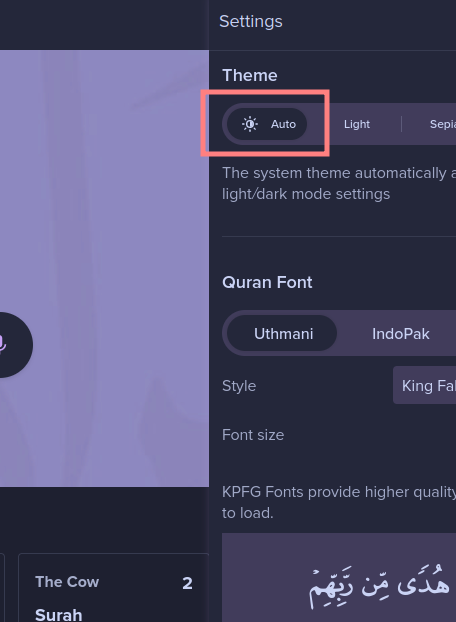

<h3 align="center">
	 
	
	Catppuccin for <a href="https://quran.com">Quran</a>
	
</h3>

    
    
    
    

  

## Previews

🌻 Latte (Dark Base, Mauve)

  
PC

  
  
Mobile

  

🪴 Frappé (Dark Base, Mauve)

  
PC

  
  
Mobile

  

🌺 Macchiato (Dark Base, Mauve)

  
PC

  
  
Mobile

  

🌿 Mocha (Dark Base, Mauve)

## Usage

1. Install Stylus extension for [Firefox](https://addons.mozilla.org/en-US/firefox/addon/styl-us/), [Chrome](https://chrome.google.com/webstore/detail/stylus/clngdbkpkpeebahjckkjfobafhncgmne) or [Opera](https://addons.opera.com/en-gb/extensions/details/stylus/)
2. Then install with Stylus ([click on the link](https://raw.githubusercontent.com/mustafakhalaf-git/quran/main/src/CatppuccinQuran.user.css)):
3. Choose Your accent color by Setting Theme in Stylus Options

4. Make sure your base quran theme is set to auto mode

## 💝 Thanks to

- [mustafakhalaf-git](https://github.com/mustafakhalaf-git) (Inspired by  [Catppuccin for YT](https://github.com/catppuccin/youtube/))

&nbsp;

	

	Copyright &copy; 2021-present <a href="https://github.com/catppuccin" target="_blank">Catppuccin Org</a>

	

